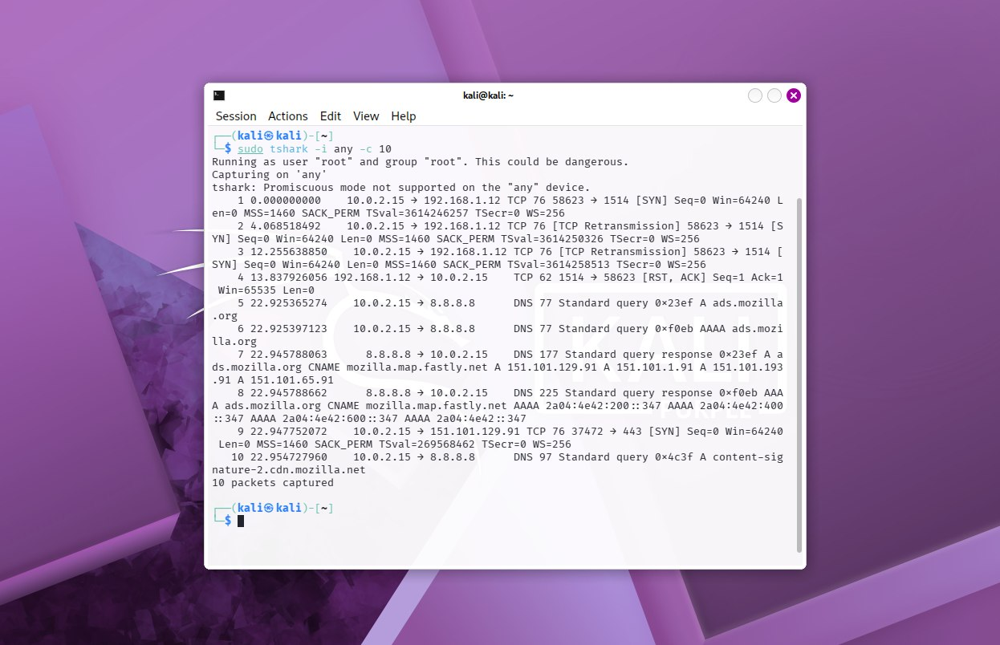

# Kali-Purple-SOC-Ops - Suite Defensiva SOC L1 (Kali Purple)

Este repositorio es la continuación operativa de **Linux-SOC-Labs**. Aquí documento el despliegue y uso de la suite defensiva de **Kali Purple** orientado al rol de **SOC Analyst L1 / Blue Team**. Enfocado en Detect, Protect y Respond.

**Entorno:** Kali Purple en VirtualBox | **Lenguaje:** Shell (Bash) / Python | **Repo base:** [Linux-SOC-Labs](https://github.com/gutierrezsebasg/Linux-SOC-Labs)

---

## Módulo 1: Despliegue, Auditoría y Verificación del Entorno Defensivo [Completado]

### Descripción General
Auditoría de la suite defensiva de Kali Purple, resolución de dependencias faltantes y validación de captura en vivo para dejar la estación L1 operativa para inspección de tráfico.

### Comandos y Herramientas Utilizadas
```bash
which tshark tcpdump ufw # Verifica binarios defensivos disponibles
sudo apt update # Actualiza índices de paquetes
sudo apt install ufw -y # Instalación de firewall para fase Protect
git clone https://github.com/volatilityfoundation/volatility3.git # Despliegue forense para fase Respond
cd volatility3 && python3 vol.py --help # Verifica despliegue de Volatility 3
sudo tshark -i any -c 10 # Verificación de captura en vivo con 10 paquetes
```

### Matriz de Herramientas Auditadas
| Herramienta | Categoría NIST | Estado | Uso SOC L1 |
| :--- | :--- | :--- | :--- |
| **Tshark** | Detect | Verificado | Inspección y filtrado de.pcap |
| **Tcpdump** | Detect | Verificado | Captura rápida en interfaces |
| **Volatility 3** | Respond | Clonado (GitHub) | Análisis forense de memoria RAM |
| **UFW** | Protect | Instalado | Contención por reglas de firewall |

### Evidencia de Análisis

*Captura de 10 paquetes con `tshark -i any -c 10`. Validación de timestamp, IP origen 10.0.2.15, DNS hacia 8.8.8.8 y tráfico TCP 1514/443. Estación L1 operativa.*

### Resultado
Estación Kali Purple L1 operativa. Binarios de Detect y Protect verificados, herramienta de Respond aprovisionada manualmente por conflicto de firmas en repos por defecto.

## Modulo 2: Analisis de Trafico de Red

### Descripcion General
Se realiza una captura y analisis de trafico HTTP utilizando `tcpdump`, con el fin de revisar el comportamiento de una peticion web y el uso de un User-Agent simulado.

### Comandos Utilizados
```bash
sudo tcpdump -i eth0 -w captura_modulo2.pcap 'tcp port 80' # Captura y guardado de trafico en archivo pcap
curl -A "Nikto-Test-SOC" [http://httpbin.org/get](http://httpbin.org/get) # Generacion de peticion HTTP con User-Agent personalizado
tcpdump -nn -r captura_modulo2.pcap # Lectura del archivo de captura
tcpdump -nn -r captura_modulo2.pcap 'tcp port 80 and (((ip[20:2] - ((ip[0]&0xf)<<2)) - ((tcp[12]&0xf0)>>2)) != 0)' # Filtrado de paquetes con payload
tcpdump -A -nn -r captura_modulo2.pcap 'tcp port 80' # Inspeccion en texto claro de las cabeceras
```
### Secuencia de Paquetes y Trazabilidad

| Evento / Paquete | Flags / Estado | Descripcion Tecnica |
| :--- | :--- | :--- |
| **Inicio de sesion** | `[S]`, `[S.]`, `[.]` | Establecimiento de conexion mediante el handshake TCP. |
| **Peticion HTTP** | `[P.]` | Envio de la solicitud `GET` con la cabecera `User-Agent: Nikto-Test-SOC`. |
| **Respuesta** | `[P.]` (200 OK) | Respuesta del servidor entregando el contenido en formato JSON. |
| **Cierre** | `[F.]`, `[.]` | Terminacion ordenada de la sesion TCP. |

### Evidencia de Analisis
Inspeccion del archivo `.pcap` en terminal. Al final se ejecuto el comando para verificar y validar los 13 paquetes capturados, confirmando el flujo completo de red y la peticion con el User-Agent simulado.

### Resultado
Practica completada. Se logro capturar, guardar e inspeccionar trafico de red real en la terminal, generando el archivo `.pcap` como evidencia para el repositorio del laboratorio.
